# Documentação Modelo Preditivo - Inteli

## Gas Prediction System
### Gas Protection Team
#### Davi de Oliveira Ferreira, Davi Nascimento de Jesus, João Victor Campos, Kaio Victor Silva, Lucas Periquito Costa, Marcelo Rubim Rossignolli, Rodrigo Lee.

## Sumário
[1. Introdução](#c1)

[2. Objetivos e Justificativa](#c2)

[3. Metodologia](#c3)

[4. Desenvolvimento e Resultados](#c4)

[5. Conclusões e Recomendações](#c5)

[6. Referências](#c6)

[Anexos](#attachments)


## <a name="c1"></a>1. Introdução

&emsp;A Compass é uma empresa criada para ampliar e diversificar o mercado de gás no Brasil, promovendo mais segurança e competitividade à matriz energética (Compass, 2024). A empresa foi criada em 2020, pelo grupo Cosan, e hoje atua prominentemente no setor de comercialização do gás, tendo em vista que o campo de distribuição antes totalmente vinculado ao Estado, ao longo dos anos, abriu espaço para que uma houvesse o surgimento de um mercado em cima desse recurso essencial no cotidiano brasileiro, o "novo mercado de gás". (Além da Energia, 2023)

&emsp;Nesse processo, ressalta-se também a IOLIT, startup da Compass voltada à adaptação tecnológica de ferramentas para gerir recursos considerados _utilities_ como a venture pela qual a empresa trará soluções tecnológicas para o mercado de gás. Ela atua intrinsecamente no projeto, já que é identificada como um dos setores que faz o controle operacional dos dados relacionados ao consumo das utilities.

&emsp;Diante da sucinta contextualização sobre a empresa e sua história, é notável que, apesar de seu grande porte e relevância, eles enfrentam, atualmente, um ponderoso problema: a presença de anomalias e fraudes na distribuição e comercialização de gás. O que configura uma situação que necessita de uma intervenção, já que, por conta dessas anomalias, a empresa não consegue fazer uma gestão de riscos mais efetiva e segura para os clientes e parceiros e tem problemas em manter a transparência completa com os stakeholders do projeto, principalmente, os usuários finais. 

&emsp;Portanto, o desenvolvimento de uma solução, vinculada à tecnologia, que visa atuar efetivamente nessa identificação das possíveis anomalias, inclusive as que se configuram como fraudes, é um passo importantíssimo a se tomar quando se pensa na revolução tecnológica de, também, esse mercado no Brasil. O projeto, dessa forma, contribui para a adaptação desse mercado, e da Compass, às novas tendências de negócios. Além disso, colabora, também, para a manutenção da empresa no topo da cadeia quando a pauta mencionada é o mercado de gás.

## <a name="c2"></a>2. Objetivos e Justificativa
### 2.1 Objetivos
&emsp;A Compass, empresa de gás e energia, enfrenta atualmente o desafio de detectar anomalias no consumo de gás como identificar padrões de fraude entre seus clientes ou falha em seus equipamentos. O objetivo geral da empresa é proporcionar uma gestão de riscos mais eficaz e segurança operacional. No geral, a empresa busca oferecer insights valiosos para otimizar as operações e identificar oportunidades de venda de serviços adicionais.

### 2.2 Proposta de solução
&emsp;Para resolver esse problema, o grupo Gas Protection Team (GPT) desenvolverá um modelo preditivo o Gas Prediction System (GPS). Esse sistema matemático utilizará algoritmos de aprendizado de máquina para monitorar e analisar os dados de consumo de gás em tempo real, identificando padrões suspeitos que possam indicar fraudes ou falhas nos equipamentos. O GPS será integrado aos sistemas atuais de monitoramento de gás da Compass, utilizando dados sensorizados coletados dos clientes. Distribuidoras de gás, condomínios e consumidores residenciais terão acesso a relatórios detalhados sobre o consumo de gás, com alertas sobre possíveis fraudes ou falhas. A precisão e eficácia do sistema serão avaliadas pela taxa de detecção de fraudes, redução de falsos positivos, feedback dos usuários e eficiência operacional.

### 2.3 Justificativa
&emsp;A necessidade do modelo surge dos desafios que a Compass enfrenta em detectar fraudes e falhas nos sistemas de consumo de gás, onde os métodos tradicionais são insuficientes para identificar padrões complexos e anomalias em tempo real. Sem essa ferramenta, a empresa fica vulnerável a perdas financeiras, riscos à segurança e ineficiências operacionais. Portanto, o modelo é essencial para melhorar a precisão e a rapidez na detecção de problemas, garantindo a segurança e a confiabilidade dos serviços prestados e também serve como um diferencial entre outras empresas do ramo de distribuição de gás.


## <a name="c3"></a>3. Metodologia

&emsp;Uma das metodologias mais utilizadas para projetos que envolvem projetos de planejamento e execução de mineração de dados é o framework CRISP-DM (Cross-Industry Standard Process for Data Mining, em português, Processo Padrão Inter-Indústrias para Mineração de Dados). Essa estrutura foi desenvolvida em 1996 por um consórcio de empresas interdependentes, já que, no final da década, a principal preocupação dessas empresas era definir processos que pudessem orientar o desenvolvimento de aplicações de Data Mining (DM) de acordo com o professor Rosalvo da Univasf.

&emsp;Essa metodologia provê 6 etapas que permitem uma abordagem estruturada para a distribuição de ações com caráter de organização em iniciativas de mineração de dados (Smart Vision Europe, 2022). São elas: Entendimento de Negócios, Entendimento de Dados, Modelagem de Dados, Avaliação e Implantação. Há ainda uma segmentação dentro dessas fases, de acordo com Helder Prado, professor do MBA em Data Science e Analytics USP/Esalq: as três primeiras fases são de coleta e organização de dados, enquanto as três últimas de criação e colocação em prática do modelo. 

&emsp;Abaixo, é apresentada uma imagem que define esse ciclo de procedimentos e, em seguida, esclarece-se cada uma dessas etapas.

<div align="center">

<sub>Figura 1 - Fases CRISP-DM</sub>

</div><br>

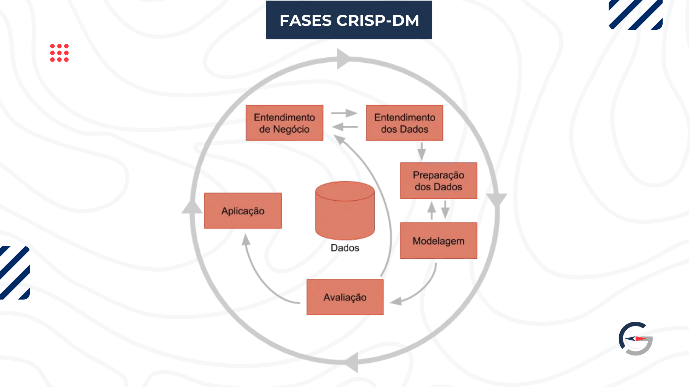<br>

<div align="center">

<sup>Fonte: Medium (2019)</sup>

</div>

1. **Entendimento de Negócio:** consiste na definição das principais metas atreladas ao projeto de Data Mining com um olhar para os problemas de negócio. Esse processo é fundamental porque traz, de antemão, a proposta de fazer uma aplicação de DM voltada a solucionar e intervir em alguma conjuntura que seja relevante para a sociedade, no contexto de Business.

2. **Entendimento dos Dados (Data Understanding):** relaciona-se ao processo que concerne a captura dos dados até a identificação de problemas vinculados à qualidade dos inputs com os quais se vai trabalhar. É também, nessa fase do CRISP, que se põe em pauta hipóteses formadas em cima do que se aprendeu com os dados.

3. **Preparação dos Dados (Data Preparation):** é tangente à preparação e pré-processamento dos dados para a modelagem. Tendo em vista as necessidades, vinculadas à qualidade, identificadas na etapa anterior, busca transformar esses dados, através de procedimentos como a limpeza e codificação, em inputs utéis para o modelo que tragam características realmente usáveis.

4. **Modelagem (Modeling):** refere-se à aplicação de técnicas de modelagem diferenciadas de acordo com o problema a ser resolvido. Essas ferramentas serão discutidas após essa seção de contextualização, já que elas são essenciais para a criação do modelo preditivo de detecção de anomalias no consumo de gás. Esta etapa pode ser executada várias vezes, ou seja, é um dos procedimentos iterativos da metodologia. Inclusive, é possível voltar a etapas anteriores para ajustar os dados de acordo com novos requisitos da técnica que se decidiu utilizar.

5. **Avaliação (Evaluation):** reflete-se nos testes com o modelo gerado para validar se atendem às necessidades do negócio. Nesse ponto, ainda, pode-se verificar se os objetivos dispostos no entendimento de negócio, que concernem nessas necessidades, podem ser concluídos com base nos avanços da equipe.

6. **Utilização ou Aplicação (Deployment):** é aqui que se coloca em prática o modelo e ele se torna usável para atingir os objetivos definidos no planejamento. Essa delimitação e definição de pronto pode ser feita com base em critérios, desde a apresentação dos resultados da modelagem para a tomada de decisão até a aplicação do modelo em um outro conjunto de dados, com a inclusão do modelo como parte do processo de geração de informação para tomada de decisão dentro empresa.

&emsp;Essas fases, então, são essenciais para compreender mais sobre a metodologia CRISP-DM, bem como compreender quais são as técnicas e ferramentas que podem ser utilizadas para aprimorar o desenvolvimento de cada etapa. Para o projeto na Compass, inclusive, que foi organizado em sprints, é essencial manter em mente essa organização cronológica, já que ela oferece um passo-a-passo a ser seguido para conseguir atingir o proposto de detectar anomalias, sempre se atendo ao foco em intervir em um contexto de negócios e ser orientado ao seu usuário.

## <a name="c4"></a>4. Desenvolvimento e Resultados
### 4.1. Compreensão do Problema
#### 4.1.1. Contexto da indústria 

&emsp;A indústria de gás natural no Brasil é dominada por grandes players que atuam na distribuição e fornecimento de gás em todo o território nacional. Entre os principais concorrentes da Compass em âmbito nacional estão a Petrobras, uma das maiores produtoras de gás natural do país e historicamente a principal fornecedora. Outra que se destaca é a Gás Natural Fenosa, que tem uma presença significativa no mercado de distribuição. Por fim, a terceira que foi elencada através de pesquisa bibliográfica, foi a Gás Brasiliano, que atua na distribuição de gás no eixo sudeste proeminentemente. A Compass, através da Comgás, também se destaca como a maior distribuidora de gás natural no Brasil, e líder de mercado no nicho de  comercialização do gás natural, solidificando sua posição no mercado com uma vasta rede de clientes industriais, comerciais e residenciais (Compass, 2024)

&emsp;Conforme exposto, é notável que o modelo de negócio das empresas de gás natural no Brasil se concentra principalmente na distribuição e comercialização de gás natural. As empresas que fazem parte desse mercado operam redes extensas de gasodutos que conectam os pontos de produção aos consumidores finais, que incluem desde grandes indústrias até residências em várias regiões do país, isso, no que diz refere às empresas citadas anteriormente. Recentemente, com as mudanças regulatórias e a liberalização do mercado de gás, há um foco crescente na personalização de serviços e no desenvolvimento de soluções energéticas integradas que permitem maior eficiência no uso de gás. Além disso, muitas empresas estão explorando novos modelos de contrato que oferecem maior flexibilidade e opções de preço mais competitivas (Além da Energia, 2023).

&emsp;As tendências atuais na indústria de gás natural no Brasil refletem um movimento global em direção à descarbonização e à adoção de energias mais limpas. A abertura do mercado de gás no Brasil, por meio do "Novo Mercado de Gás" (Brasil, 2023), está promovendo maior concorrência, o que pode beneficiar consumidores com preços mais baixos e melhores serviços. É importante mencionar, inclusive, que esse mercado, nos próximos anos, é passível de receber R$50 bilhões em investimentos (Além da Superfície, 2024). Além disso, há uma crescente pressão para que as empresas de gás natural invistam em alternativas mais sustentáveis, como o biogás e o hidrogênio verde, que estão sendo, atualmente, exploradas como potenciais substitutos ou complementos ao gás natural. As empresas estão adaptando seus portfólios e estratégias para se manterem competitivas e relevantes em um mercado que está em transformação constante.

&emsp;Essa contextualização é importante, então, para se ter noção de um mercado com tantas nuances quanto o mercado de gás no Brasil atualmente. Como uma ferramenta essencial para pôr em panorama e aprofundar o entendimento do setor, o modelo de 5 forças de Porter permite ter uma perspectiva ainda mais aprofundada no que concerne aos relacionamentos que a empresa possui com os stakeholders e players do mercado em que participa. Essa análise pode ser vista a seguir:

**Modelo das 5 Forças de Porter**

&emsp;O Modelo das 5 Forças de Porter, instrumento de gestão setorial desenvolvido por Michel Porter nos anos 70, oferece um formato que torna possível a examinação da dinâmica e competição de um mercado específico. Segundo Casarotto (2020), a ferramenta, que tem seu intuito diretamente relacionado à contextualização setorial, concede uma análise abrangente dos concorrentes, fornecedores, consumidores e outros atores-chave. Sob o prisma disposto, é notório que cinco aspectos primordiais estão envolvidos no contexto do framework analítico: rivalidade entre concorrentes, poder de negociação dos fornecedores, influência dos consumidores, ameaça de novos concorrentes e ameaça de produtos substitutos.

<div align="center">

<sub>Figura 2 - Modelo das 5 Forças de Porter</sub>

</div><br>

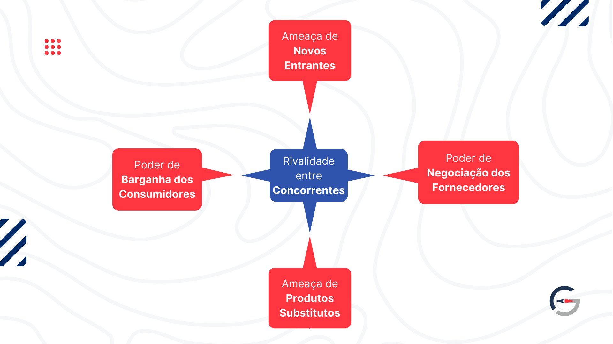<br>

<div align="center">

<sup>Fonte: Material produzido pelos autores (2024)</sup>

</div>

&emsp;Diante do cenário descrito, é importante desenvolver essa análise para que seja possível observar o referencial de determinada empresa em relação ao setor que ela faz parte. Assim, no contexto da Compass, empresa que se destina a amplificar e tornar mais plural o mercado de gás no Brasil, promovendo mais segurança e competitividade à matriz energética (Compass, 2024), dispõe-se que:

**Rivalidade entre concorrentes existentes**

&emsp;A Compass é uma iniciativa de 2020 da Cosan, empresa que investe em ativos irreplicáveis que promovem o desenvolvimento da sociedade (Cosan, 2024). Com isso em foco, é evidente que o grupo e as empresas atuam em um setor altamente competitivo, que inclui a distribuição de gás e energia. Os principais concorrentes incluem grandes players nacionais e internacionais, como a Petrobras. Entretanto, por focar em gás natural e não o GLP, gás liquefeito de petróleo, a Compass e o grupo foram capazez de assegurar um oceano azul em território brasileiro, se tornando líder e referência de mercado.

&emsp;A obtenção da Congás, maior distribuidora de gás natural do país, pelo grupo em 2012 (Cosan, 2024) abriu o caminho para que as instituições da holding se destacassem. A robustez e o histórico, consagrado pelas aquisições relevantes do grupo Cosan, beneficiaram e propulsionaram as iniciativas do conjunto. No entanto, a Compass ainda enfrenta a competição em termos de capacidade de distribuição, alcance geográfico, e tecnologia. Rivalidade essa que se torna especialmente acirrada em áreas como a expansão de infraestrutura pelo território nacional como na construção de gasodutos, que implica em maior capacidade de acesso, e inovação em soluções energéticas integradas, onde a empresa e suas concorrentes buscam constantemente melhorar a eficiência e oferecer serviços diferenciados.

**Poder de Negociação dos Fornecedores**
  
&emsp;Os fornecedores de gás natural têm um poder de barganha significativo, influenciado pela dependência expressiva que o Brasil tem de importações estrangeiras, principalmente da Argentina e Bolívia (Sprenger, 2024) e pela volatilidade dos preços no mercado internacional. A Compass, como parte do grupo Cosan, utiliza a força do conglomerado para negociar contratos de fornecimento mais favoráveis, mitigando alguns dos desafios impostos pelos fornecedores. A diversificação das fontes de fornecimento, incluindo produtores locais e internacionais, é uma estratégia utilizada para garantir a estabilidade e a competitividade da empresa no mercado.

&emsp;A capacidade da Compass de negociar em nome do grupo Cosan oferece uma vantagem competitiva, mas os riscos associados às flutuações nos preços globais e às questões geopolíticas ainda representam desafios significativos. Além disso, a qualidade e a continuidade do fornecimento de gás são fatores críticos que exigem que a Compass mantenha relações sólidas e de longo prazo com seus fornecedores. Para assegurar um fornecimento confiável e reduzir a exposição a riscos, a empresa precisa estar sempre atenta às mudanças no mercado global e adaptar suas estratégias de negociação de acordo com as condições do setor.

**Poder de Barganha dos Consumidores**

&emsp;Os consumidores da Compass, que incluem grandes indústrias, usinas termelétricas e distribuidoras regionais, e, de forma indireta, os condomínios e usuários finais, exercem um poder de barganha considerável devido ao volume significativo de gás natural que consomem. Essas empresas, especialmente as grandes indústrias, têm a capacidade de negociar contratos com condições mais vantajosas, pressionando a Compass a oferecer tarifas competitivas e soluções personalizadas que atendam às suas necessidades específicas. A manutenção de relacionamentos fortes e de longo prazo com esses consumidores é essencial para garantir a fidelidade e a continuidade dos negócios.

&emsp;Além dos grandes consumidores, a Compass também precisa lidar com a influência das distribuidoras regionais de gás, que são intermediárias importantes na cadeia de distribuição. A capacidade de oferecer um serviço confiável e eficiente é de suma relevância para manter esses contratos, especialmente em um mercado onde alternativas energéticas estão se tornando cada vez mais viáveis. Até mesmo com a Comgás, empresa da holding, são necessárias negociações extensas para que a Compass consiga tomar parte da distribuição. A empresa deve continuar investindo em tecnologia e em estratégias de marketing que demonstram o valor agregado de suas ofertas, diferenciando-a de outros players, garantindo que suas tarifas e serviços permaneçam competitivos e atrativos para todos os tipos de consumidores.

**Ameaça de Novos Entrantes**

&emsp;O setor de distribuição de gás natural no Brasil é tradicionalmente dominado por grandes players, com barreiras significativas à entrada, como os altos custos de infraestrutura ao longo do território nacional e a necessidade de conformidade regulatória. No entanto, a desregulamentação e a liberalização recentes do mercado de gás no Brasil abriram oportunidades para novos entrantes. Empresas estrangeiras com capital e expertise podem tentar explorar o mercado brasileiro, especialmente em nichos específicos ou regiões menos atendidas, representando uma ameaça potencial para a Compass.

&emsp;Para mitigar essa ameaça, a Compass deve continuar a investir em infraestrutura, como gasodutos e terminais de GNL, que são essenciais para consolidar sua posição de mercado e dificultar a entrada de novos concorrentes. Além disso, a empresa precisa estar atenta às inovações tecnológicas que podem reduzir os custos de entrada para novos players. Dando como exemplo: soluções de energia descentralizada ou tecnologias digitais que otimizam a distribuição de gás. A capacidade de se adaptar rapidamente a essas mudanças e de continuar liderando em inovação proporcionará a Compass a possibilidade de se manter competitiva e protegida contra novos entrantes no mercado.

**Ameaça de Produtos e Serviços Substitutos**

&emsp;A ameaça de substitutos para o gás natural vem principalmente das energias renováveis, como solar e eólica, que estão ganhando popularidade e se tornando mais acessíveis à medida que o Brasil avança em sua transição energética. A Compass enfrenta o desafio de competir com essas alternativas, que são cada vez mais vistas como soluções mais sustentáveis e economicamente viáveis, especialmente em setores onde a descarbonização é uma prioridade. Para se manter relevante, a Compass pode precisar considerar a diversificação de seu portfólio energético, o que a empresa já pensa, sendo, conforme sua própria definição, uma empresa de gás e energia (Compass, 2024). É necessário, então, que continuem investindo em tecnologias limpas ou em soluções híbridas que combinem gás natural com outras fontes de energia.

&emsp;Além das energias renováveis, outras formas de energia, como o biogás, que não é um combustível fóssil, também representam uma ameaça crescente, especialmente em regiões com políticas ambientais rigorosas ou incentivos para a adoção de alternativas mais sustentáveis. A Compass deve monitorar de perto essas tendências e estar pronta para adaptar suas estratégias de mercado. Isso pode incluir o desenvolvimento de parcerias com empresas de energias renováveis, a implementação de tecnologias que aumentem a eficiência do uso do gás natural, ou até mesmo a exploração de novos mercados onde a demanda por gás natural permaneça robusta.

#
&emsp;Portanto, o desenvolvimento da análise disposta é importante para não somente apresentar o mercado e o nicho setorial que é ocupado pela Compass, mas também apresentar as suas únicas contribuições que a fazem ser relevante nesse setor que ainda está sendo moldado no Brasil, através da vinda do "Novo Mercado de Gás".

#### 4.1.2. Análise SWOT 

&emsp;A Análise SWOT é uma ferramenta estratégica amplamente utilizada para avaliar as forças, fraquezas, oportunidades e ameaças de uma organização. Conforme descrito por Souza e Carvalho (2019), essa metodologia é especialmente relevante para pequenas empresas, pois permite uma compreensão abrangente dos fatores internos e externos que impactam o negócio. Através da identificação desses elementos, a Análise SWOT auxilia na formulação de estratégias eficazes, que são essenciais para o desenvolvimento e a competitividade das organizações no mercado.

<div align="center">
<sub>Figura 3 - Matriz SWOT</sub>
</div>
<br>

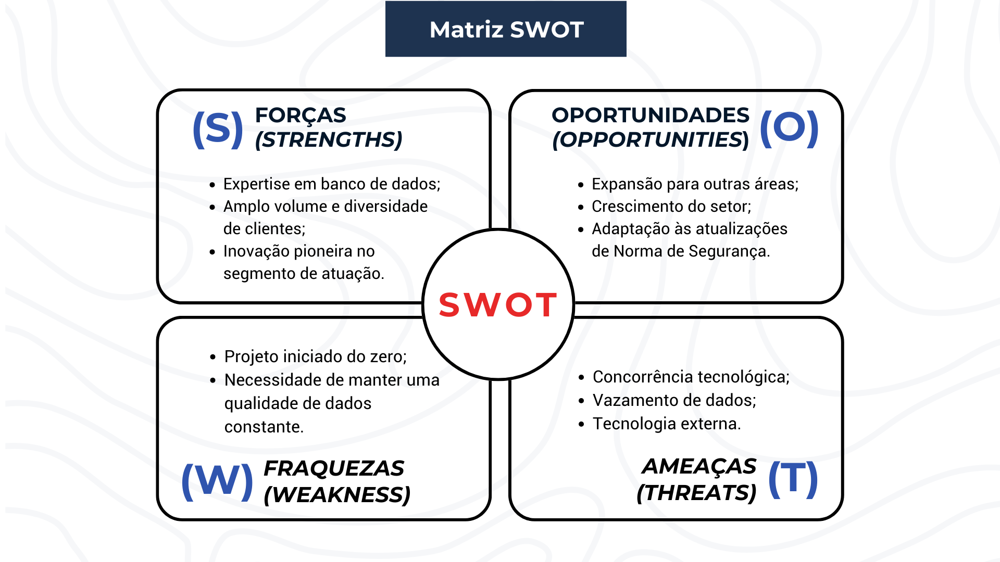<br>

<div align="center">
<sub>Fonte: Material produzido pelos autores (2024)</sub>
</div>

&emsp;Com base em aprofundar sobre esse artefato de negócios contextualizado pela introdução e para acessibilidade visual, discorre-se sobre a imagem acima a seguir:

#### Explicação dos tópicos apontados:

***FORÇAS:***

- **Expertise em banco de dados:** Compass e a IOLIT possuem um forte posicionamento na área de tecnologia envolvendo dados, possuindo outras formas de predição dentro da empresa, como saber o quanto eles precisam comprar de gás para o dia seguinte com base em dados do dia anterior.

- **Ampla base de clientes:** Com o tamanho da companhia, eles atendem diversos clientes finais garantindo assim uma base sólida mas que também abre para um potencial de crescimento.

- **Inovação pioneira:** Com a ideia apresentada por eles para o desenvolvimento de um modelo preditivo para contornar fraudes e falhas de equipamentos nas redes de distribuição coloca a empresa na vanguarda no quisito de inovação dentro da área.

***FRAQUEZAS:***

- **Projeto iniciado do zero:** Tanto a Compass qaunto sua vertente IOLIT são novas no mercado e podem apresentar um pouco de instabilidade ao tocar projetos.

- **Necessidade de manter uma qualidade de dados constante:** Os dados precisam estar em uma qualidade muito boa para que afete a qualidade de predição do modelo, sendo necessário sempre estar realizando uma limpeza dos dados.

***OPORTUNIDADES:***

- **Expansão para outras áreas:** O limite dos Insights gerados pelo modelo é quase inexistente, fazendo assim existir a possibilidade de vender serviços adicionais para outros ramos de energia, como gestão de risco e eficiência operacional.

- **Crescimento do setor:** Com o aumento da demanda por soluções tecnológicas dentro da área de energia visando monitoriamento e eficiência, a Compass tem grande potencial de capturar uma parcela significativa dessa demanda.

- **Adaptação às atualizações de Norma de Segurança:** A detecção de anomalias por meio de um modelo preditivo pode ser um diferencial competitivo importante no futuro, principalmente por conta do aumento das regulações de segurança e conformidade.

***AMEAÇAS:***

- **Concorrência Tecnológica:** Caso não haja evolução constante do modelo e expansões para outras áreas, outras empresas podem ameaçar a posição da Compass no mercado

- **Vazamento de dados:** A manipulação de grandes volumes de dados sensíveis podem acarretar em exposição da empresa à riscos de segurança cibernética e vazamentos de dados.

- **Tecnologia externa**: Ao utilizarem o Google Colab para rodar seus modelos, a empresa fica a mercê e dependente da própria ferramente do google, podendo haver falhas causadas por fatores de terceiros que a Compass não consiguirá controlar.

&emsp;A análise SWOT da Compass e sua vertente IOLIT revela uma forte posição no mercado de tecnologia de dados, com especialização em detecção de anomalias no consumo de gás e prevenção de fraudes. As principais forças incluem sua expertise em dados e tecnologia, além de um foco claro em inovação e uma ampla base de clientes B2B. Contudo, a dependência de tecnologia desenvolvida externamente e a necessidade de dados bem preparados representam fraquezas que podem impactar a escalabilidade e a eficácia dos modelos preditivos.

&emsp;As oportunidades incluem a expansão de serviços adjacentes e o crescimento no setor de energia, impulsionado pela demanda por soluções tecnológicas. No entanto, ameaças como a concorrência tecnológica e os riscos de segurança cibernética exigem atenção para mitigar possíveis impactos negativos. Esses insights ajudam a Compass e a IOLIT a identificar suas vantagens competitivas e áreas que necessitam de cuidado para maximizar seu sucesso no mercado.

#### 4.1.3. Planejamento Geral da Solução

**Dados disponíveis:**

<div align="center">
<sub>Tabela 1 - Representação dos dados disponíveis</sub><br>
</div>

| Campo API | Nome descritivo | Descrição |
| --------- | --------------- | --------- |
| clientCode|  Codigo do Cliente | Identificador unico do cliente possui um unico código, vinculado diretamente ao CPF ou CNPJ do cliente. |
| clientIndex |  Indice do cliente | Identificador unico para cada instalaçao(medidor) realizada vinculada ao cliente. |
|date| Data de recepção| Data de recepçao da informaçaopelo ecossistema lora |
|meterIndex | Leitura atual | Valor da leitura atual do medidor| 
|initialIndex | Valor inicial do equipamento | Valor inicial do equipamento quando foi realizada a instalação do sensor |
|pulseCount| Valor de pulso| Valor de pulsos lidos referencial ao consumo|
| gain | Valor de ganho | Fator de multiplicacao de pulsos para metros cubicos |
| rssi | Intensidade de sinal | Intensidade de sinal do sensor ao gateway da publicacao |
|gatewayGeoLocation.alt |Altitude ou Altura do gateway| Valor de altura/altitude da instalação do gateway|
| gatewayGeoLocation.lat | Latitude do gateway | Valor de latitude da instalação do gateway|
| gatewayGeoLocation.long | Longitude do gateway | Valor de longitude da instalação do gateway |
|model |Modelo do equipamento |Modelo do equipamento|
|serialNumber| Serial do equipamento| Modelo do equipamento|
|meterSN |Numero do medidor de cada instalação| Numero do medidor de cada instalacao |
|inputType| Tipo de leitura do medidor| Tipo de leitura do medidor|

<div align="center">
<sub>Fonte: Material produzido pelos autores (2024)</sub>
</div>


**Solução proposta:**

&emsp;A solução é o desenvolvimento do Gas Prediction System (GPS), um modelo preditivo que utiliza algoritmos de aprendizado de máquina para monitorar e analisar os dados de consumo de gás em tempo real. O GPS identificará fraudes e falhas nos equipamentos, integrando-se aos sistemas de monitoramento da Compass e fornecendo relatórios detalhados e alertas para os clientes.

**Tipo de tarefa:** 

&emsp;A principal tarefa é de classificação, pois o objetivo é identificar padrões que indicam anomalias, categorizando os eventos como suspeitos ou não.

**Utilização da solução:** 

&emsp;O GPS (Gas Prediction System), solução proposta, será utilizado para monitorar continuamente o consumo de gás em tempo real. Ele fornecerá relatórios detalhados e alertas sobre possíveis fraudes ou falhas para distribuidoras de gás, condomínios e consumidores residenciais, auxiliando na tomada de decisões e na gestão de riscos.

**Benefícios:**

&emsp;A solução trará melhorias significativas na detecção de fraudes, aumento da segurança operacional, insights para otimização das operações, e maior confiabilidade tanto para a Compass quanto para seus clientes. Além disso, abre oportunidades para a venda de serviços adicionais com base nos insights gerados.

**Critério de sucesso e métrica:**

&emsp;O sucesso será medido pela taxa de detecção de fraudes, a redução de falsos positivos, o feedback positivo dos usuários e a melhoria na eficiência operacional. A precisão do modelo e seu impacto na segurança e na confiabilidade do sistema serão as principais métricas de avaliação.

#### 4.1.4. Canvas Proposta de Valor
&emsp;O Canvas Proposta de Valor é uma ferramenta visual que auxilia na compreensão da relação entre a proposta de valor de uma empresa e as necessidades e desejos de seus clientes (Osterwalder et al., 2014). Ele divide essa relação em dois blocos principais: o Perfil do Cliente e o Mapa de Valor.

<ul>
<li>Perfil do Cliente: detalha as tarefas, dores e ganhos do cliente, ou seja, o que ele busca realizar, os problemas que enfrenta e os benefícios que espera obter.</li>
<li>Mapa de Valor: descreve os produtos e serviços oferecidos, os aliviadores de dores e os criadores de ganhos, mostrando como a empresa pretende solucionar os problemas do cliente e gerar valor para ele.</li>
</ul>

&emsp; A principal função do Canvas Proposta de Valor é garantir que a empresa esteja criando produtos e serviços que realmente atendam às necessidades de seus clientes, evitando o desenvolvimento de soluções que não geram valor para o mercado.
<br>

<div align='center'>
<sub>Figura 4 - Canvas Proposta de Valor</sub>
</div><br>

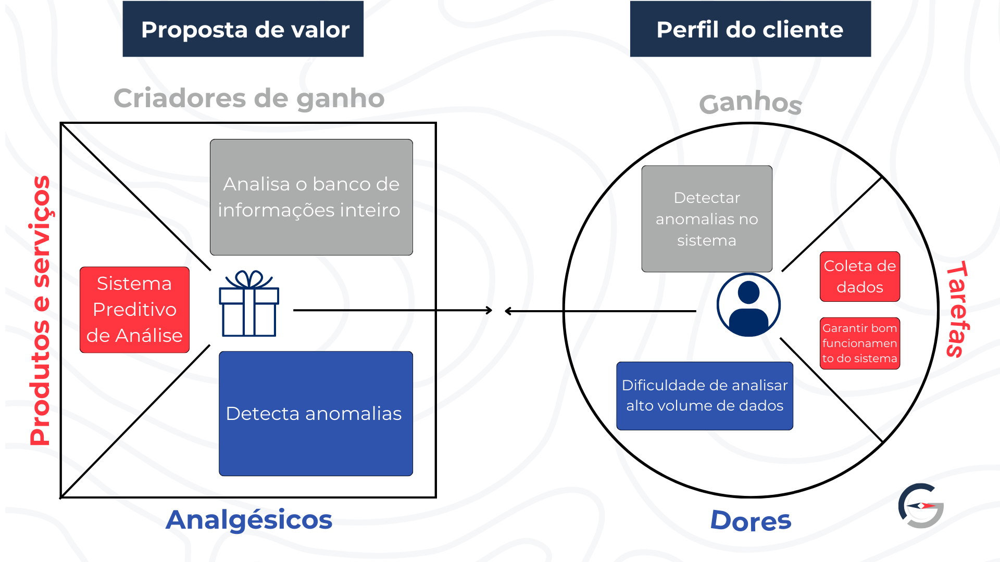<br>
<div align ='center'>
<sup>Fonte: Material produzido pelos autores (2024)</sup>
</div><br>

&emsp;Em essência, este Value Proposition Canvas serve como um guia para o projeto, garantindo que ele esteja sempre alinhado com as necessidades do cliente. Ele destaca de maneira objetiva e direta as funcionalidades que o sistema deve ter, como a análise de grandes volumes de dados e a detecção de anomalias baseada em padrões, e define critérios claros para medir o sucesso do projeto, como a capacidade de detectar anomalias, possibilitando a percepção de possíveis problemas. 

&emsp;Além disso, o Canvas atua como uma ferramenta de comunicação eficaz, permitindo apresentar a proposta de valor do sistema para as partes interessadas e orientar decisões importantes sobre o desenvolvimento e a alocação de recursos. 

&emsp;Em suma, ele garante que o projeto entregue valor real ao cliente e atenda às suas necessidades específicas, mantendo o foco no que realmente importa.

#### 4.1.5. Matriz de Riscos

&emsp;Foi utilizada a matriz de riscos para avaliar os possíveis desafios do projeto. Esse método é empregado para gerenciar futuros eventos incertos. A matriz avalia esses eventos com base em seus impactos (eixo x) e na probabilidade de ocorrência (eixo y), de maneira qualitativa. A partir dessa análise, os eventos são posicionados no diagrama. Esse instrumento permite "identificar quais riscos que devem receber mais atenção" (NAPOLEÃO, 2019). A elaboração da matriz possibilita o desenvolvimento de planos de ação, prevenção e planejamento diante de potenciais problemas. Segue a primeira iteração da matriz de riscos:

<div align="center" width="100%">
<sub>Figura 5 - Matriz de Riscos - 1º sprint</sub>
</div><br>

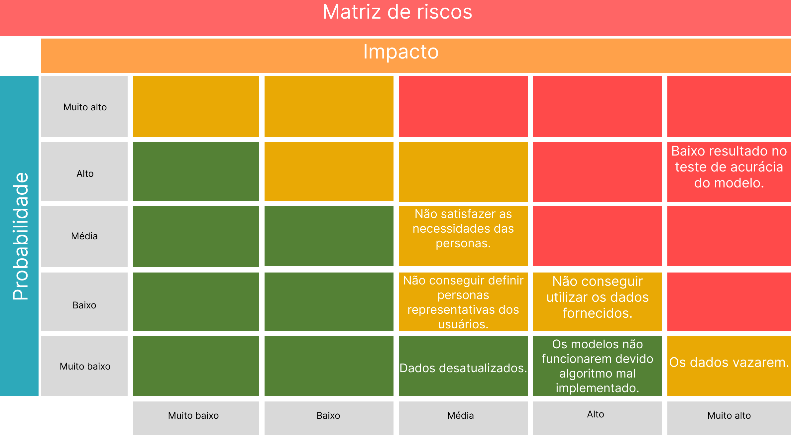<br>

<div align="center">
<sup>Fonte: Material produzido pelos autores (2024)
</sup>
</div>

&emsp;Conforme a imagem acima, discorre-se abaixo sobre os riscos encontrados e as classificações atribuídas a eles pelo grupo:

- **"Os dados vazarem."** (alto impacto e muito baixa probabilidade.) É de alto impacto, pois vai contra a LGPD que podem resultar em penalidades. A probabilidade é baixa, pois os membros do grupo se comprometeram a estar conscientes e atentos à LGPD.
- **"Os modelos não funcionarem devido algoritmo mal implementado."** (alto impacto e muito baixa probabilidade.) Possui alto impacto, pois a conclusão do nosso projeto depende do funcionamento dos modelos. É esperada uma probabilidade muito baixa, pois o grupo tem 10 semanas para garantir que tudo funcione.
- **"Dados desatualizados."** (médio impacto e muita baixa probabilidade.) O impacto é médio, pois mesmo se os dados estiverem desatualizados, é possível criar um modelo, embora ele não esteja atualizado. A probabilidade é muito baixa, pois a Compass mencionou que os dados seriam do semestre passado..
- **"Não conseguir utilizar os dados fornecidos."** (alto impacto e de baixa probabilidade.) É de alto impacto, pois sem conseguir utilizar os dados, não é possível produzir os modelos. Além disso, pode variar quais dados são utilizáveis.
- **"Não conseguir definir personas representativas dos usuários."** (médio impacto e baixa probabilidade.) Impacto médio, pois as personas auxiliam no desenvolvimento do projeto, mas não são essenciais para a utilização dos dados e a criação de um modelo. A probabilidade é baixa devido ao fato de que o grupo produziu personas no módulo passado.
- **"Não satisfazer as necessidades das personas."** (médio impacto e média probabilidade.) Impacto médio e probabilidade média, pois vamos verificar isso ao longo do desenvolvimento do projeto.
- **"Baixo resultado no teste de acurácia do modelo."** (impacto muito alto e alta probabilidade.) Impacto muito alto, pois resultaria em um modelo desfavorável. Alta probabilidade, pois se trata da primeira vez que o grupo está produzindo um modelo preditivo e o projeto ainda está em sua primeira sprint. Planeja-se remanejar esse risco, conforme as iterações da matriz.

**Planos de ação:**

&emsp;Após elencar os riscos, é necessário que se faça um planejamento de como reagir caso algum dos desafios citados venha a ocorrer e, melhor, prevenir que esses riscos aconteçam. Dessa maneira, visa-se seguir os planos de ações individualizados para cada risco, como delineado a seguir:

- **"Os dados vazarem":** Pode ser evitado estabelecendo uma política de privacidade funcional condizente com a LGPD.

- **"Os modelos não funcionarem devido algoritmo mal implementado.":** Pode ser evitado buscando verificar, revisar e testar o código com frequência. Tanto o uso de testes automatizados como de dados simulados pode prevenir um algoritmo que não funcione.
 
- **"Dados desatualizados.":** Resultarão em um modelo desatualizado, porém ainda poderá ser utilizado. É possível buscar a criação de um modelo atualizado com dados atualizados.

- **"Não conseguir utilizar os dados fornecidos.":** Tentar comunicar com a controladora dos dados para tentar obter as mesmas informações (em um outro formato) ou mais, com uma qualidade maior.

- **"Não conseguir definir personas representativas dos usuários.":** Ao criar as personas é de interesse que sejam baseadas em bastante pesquisa e informações. Se necessário, utilizar formulários para coletar informações.

- **"Não satisfazer as necessidades das personas.":** Isso pode ser evitado se ao longo do projeto forem utilizadas as personas, de forma fiel, no desenvolvimento do modelo.

- **"Baixo resultado no teste de acurácia do modelo.":** Caso isso aconteça, dependendo da quantidade de tempo disponível, é possível utilizar esse resultado como referência para aprimorar o modelo. 

Em um desenvolvimento organico de um projeto, a atualização da matriz de risco reflete uma evolução no entendimento da proposta e nas prioridades estratégicas, o que demonstra um amadurecimento na análise de possíveis desafios. 


<div align="center" width="100%">
<sub>Figura 6 - Matriz de Riscos - 3º sprint</sub>
</div><br>

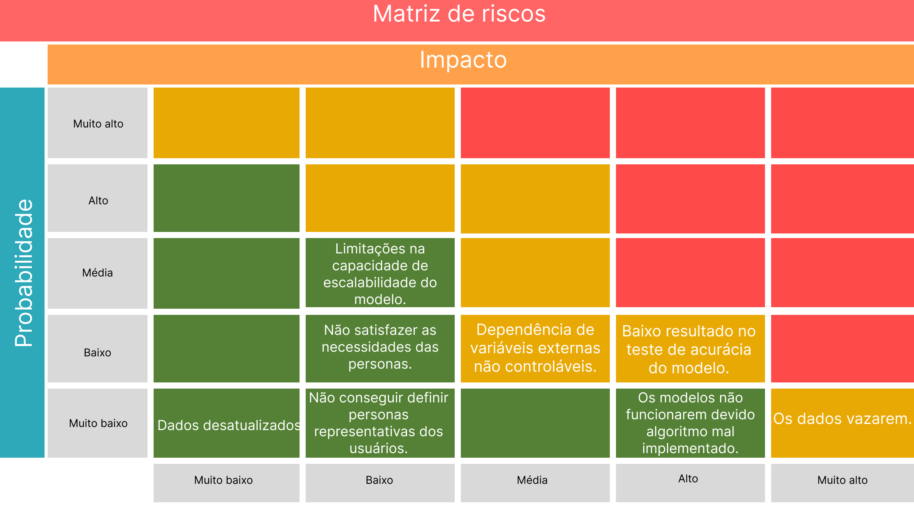<br>

<div align="center">
<sup>Fonte: Material produzido pelos autores (2024)
</sup>
</div>

&emsp;Conforme a imagem acima, discorre-se abaixo sobre a atualização dos riscos encontrados e as classificações atribuídas a eles pelo grupo:

- **"Dados desatualizados"**:

Explicação: O impacto foi rebaixado de médio para muito baixo, refletindo a percepção de que, mesmo com dados desatualizados, o projeto ainda pode avançar sem comprometimentos significativos. Isso se deu pela confirmação de que os dados utilizados são recentes o suficiente para o propósito do modelo. A probabilidade permaneceu baixa, reforçando a confiança no fornecimento de dados atualizados.

- **"Não conseguir definir personas representativas dos usuários"**

Explicação: O impacto foi reduzido para baixo, indicando que, embora um risco maior no início do projeto, as personas foram bem identificadas e construidas durante esse período, aumentando as chances de sucesso do modelo.


- **"Não satisfazer as necessidades das personas"**

Explicação: A probabilidade de não atender às necessidades das personas foi reduzida, o que sugere que o time está mais confiante no alinhamento do projeto com as expectativas dos usuários além de que os requisitos das personas foram melhor compreendidos e integrados no desenvolvimento.

- **"Dependência de variáveis externas não controláveis"**

Explicação: Esse novo risco reflete a consciência de que fatores externos, como mudanças climáticas ou eventos imprevistos, podem influenciar o consumo de gás e, consequentemente, a eficácia do modelo. O impacto é classificado como médio, mas com baixa probabilidade, mostrando uma preocupação relevante, mas não crítica.

- **"Os modelos não funcionarem devido a algoritmo mal implementado"**

Explicação: Este risco continua sendo uma das principais preocupações, já que a integridade do algoritmo é crucial para o sucesso do projeto. A probabilidade permanece muito baixa, porque o time continua confiante na implementação do algoritmo, dado o tempo e os recursos disponíveis para testes e ajustes.

- **"Os dados vazarem"**

Explicação: Este risco foi significativamente reclassificado, indicando uma nova avaliação dos riscos relacionados à segurança dos dados. A nova classificação reflete uma maior preocupação com a proteção de dados e a conformidade com a LGPD, considerando que uma violação pode ter consequências severas.

- **"Baixo resultado no teste de acurácia do modelo"**

Explicação: A probabilidade de um baixo desempenho do modelo foi reduzida porque, ao longo do projeto, o time adquiriu maior confiança na capacidade de desenvolver um modelo acurado, devido aos aprendizados obtidos e nas análises feitas dos dados.

- **"Limitações na capacidade de escalabilidade do modelo"**

Explicação: Este risco foi adicionado para destacar a preocupação com a escalabilidade do modelo. Embora o impacto seja considerado baixo, a probabilidade média indica que a equipe está ciente dos desafios técnicos relacionados à expansão do modelo para lidar com volumes maiores de dados ou a aplicação em diferentes contextos e regiões de variáveis distintas.

&emsp;Por fim, a matriz de riscos é uma ferramenta essencial para o projeto de modelo preditivo que está sendo desenvolvido em parceria com a Compass. Essa ferramenta é muito útil porque permite visualizar e organizar os potenciais riscos de forma clara e gráfica, facilitando a tomada de decisões. Com ela, é possível antecipar problemas e planejar respostas eficazes. É importante ressaltar que os riscos dispostos nela são iterativos, então se espera que conforme o andamento do projeto, riscos que sejam proeminentes atualmente se alterem conforme as medidas preventivas dos planos de ação. A matriz de riscos, portanto, não só minimiza surpresas ao longo da criação do projeto, mas também fortalece a capacidade do grupo de ajustar o projeto caso os riscos se concretizem.

#### Matriz de Oportunidades
&emsp;A matriz de oportunidades é uma ferramenta utilizada para verificar possíveis oportunidades que podem ocorrer, exteriores ao projeto. Conforme Napoleão (2019), a matriz de oportunidades é uma adaptação ou até expansão da matriz de riscos. Semelhante a matriz  para gerenciamento de riscos, também são avaliados os impactos em relação as probabilidades, de diversas oportunidades. Aqui está a matriz:

<div align="center" width="100%">
<sub>Figura 7 - Matriz de Oportunidades - 1º Sprint</sub>
</div><br>

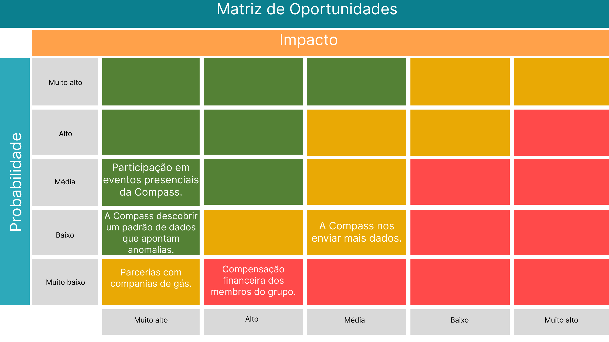<br>

<div align="center">
<sup>Fonte: Material produzido pelos autores (2024)
</sup>
</div>

&emsp;Conforme a imagem acima, discorre-se que as oportunidades podem ser classificadas e descritas como a seguir:

- **"Participação em eventos presenciais da Compass."** (impacto muito alto e probabilidade média) é de impacto muito alto pois pode familiarizar os membros da equipe com a empresa que estão trabalhando. A probabilidade é média, pois nada relacionado a esse assunto foi perguntado ou mencionado ao parceiro.
- **"A Compass descobrir um padrão de dados que apontam anomalias."** (impacto muito alto e probabilidade baixa) Isso tem um impacto muito alto porque não existe um padrão definido atualmente, o que significa que o grupo precisa descobrir esse padrão. Se esse padrão fosse fornecido pela Compass, a quantidade de trabalho necessária para o grupo seria reduzida pela metade. A probabilidade é baixa, pois o parceiro nos informou que eles não encontraram nenhum padrão.
- **"A Compass nos enviar mais dados."** (impacto medio alto e baixa probabilidade) Tem um impacto médio, pois é difícil prever como isso alteraria a criação do modelo e depende da quantidade adicional de dados que serão disponibilizados. Um excesso de dados seria difícil de armazenar. A probabilidade é baixa porque a quantidade de dados a ser disponibilizada para o grupo foi reduzida.
- **"Parcerias com companias de gás."** (impacto muito alto e probabilidade muito baixa) Teria um impacto muito alto, pois significaria uma grande influência no projeto, além de demandar uma quantidade significativa de tempo e esforço. A probabilidade é muito baixa, pois a própria Compass já possui uma startup dedicada a esse âmbito.
- **"Compensação financeira dos membros do grupo."** (alto impacto e muita baixa probabilidade) Alto impacto, porque motivaria o grupo e permitiria que os membros utilizassem mais tempo, além das 10 semanas, para desenvolver o projeto. Baixa probabilidade, pois o projeto está associado ao Inteli.

Como na matriz de riscos, devem-se também atualizar as informações para a matriz de oportunidade.

<div align="center" width="100%">
<sub>Figura 8 - Matriz de Oportunidades - 3º sprint</sub>
</div><br>

<br>

<div align="center">
<sup>Fonte: Material produzido pelos autores (2024)
</sup>
</div>

- **Participação em eventos presenciais da Compass**

Explicação: Essa possibilidade sofreu uma significativa reclassificação. Anteriormente, era vista como uma oportunidade de impacto muito alto, pois permitiria ao grupo se familiarizar melhor com a empresa e estabelecer conexões valiosas. No entanto, na matriz atual, essa oportunidade foi reclassificada para impacto baixo e probabilidade baixa. Isso indica uma mudança na percepção do grupo sobre o real valor desses eventos para o projeto, possivelmente devido à avaliação de que o networking não seria tão decisivo para os resultados finais quanto inicialmente pensado.

- **A Compass enviar mais dados**

 Explicação: Foi mantida na matriz, com impacto médio e probabilidade muito baixa. Esta oportunidade foi reclassificada para uma probabilidade ainda mais baixa, refletindo um cenário em que o grupo se tornou mais ciente das limitações na obtenção de dados adicionais e tempo de projeto. O impacto, por sua vez, foi ajustado para médio, reconhecendo que esses dados impactariam mais no modelo final.

- **Compensação financeira dos membros do grupo**

 Explicação: Manteve sua posição, com impacto alto e probabilidade muito baixa. Essa oportunidade, que poderia oferecer motivação adicional e permitir um envolvimento mais profundo do grupo, continua a ser vista como desejável, mas improvável, devido ao contexto acadêmico do projeto e às limitações orçamentárias associadas.

- **A Parceria com companhias de gás**

 Explicação: Permaneceu na matriz sem alterações significativas, sendo ainda considerada de impacto muito alto e probabilidade muito baixa. Essa oportunidade continua a representar um grande potencial para o projeto, mas a baixa probabilidade reflete as dificuldades práticas em estabelecer tais parcerias, especialmente considerando o foco voltado a própria Compass, o que torna menos provável a busca de novas empresas externas.

- **A Compass descobrir um padrão de dados que apontam anomalias**

 Explicação: Foi mantida, mas com uma redução no impacto, passando de muito alto para alto. Anteriormente, isso era considerado um divisor de águas para o projeto, aliviando significativamente a carga de trabalho do grupo. Contudo, a reavaliação indica que, embora ainda seja uma oportunidade valiosa, a dependência desse fator foi reduzida, devido ao progresso do grupo em identificar padrões por conta própria e à adaptação às condições atuais. A probabilidade, no entanto, permaneceu baixa, refletindo as informações anteriores de que a Compass ainda não encontrou tais padrões.

Para além da iteração das já conhecidas oportunidades, duas novas possibilidades foram introduzidas com classificações assertivas, refletindo o amadurecimento do projeto:

- **A Expansão do Modelo para Outras Áreas do País**

Explicação: foi incluída com impacto alto e probabilidade média, sinalizando uma clara visão de crescimento e replicação do modelo em diferentes regiões. Isso mostra a confiança do grupo na escalabilidade do projeto e na possibilidade real de sua aplicação em um contexto geográfico mais amplo.

- **Análise e Padrões de Consumo da Empresa Parceira** 

Explicação: foi adicionada com impacto médio e probabilidade muito alta. Essa oportunidade reflete uma parte crucial do projeto, onde a análise contínua dos padrões de consumo da parceira não apenas sustenta o modelo, mas também oferece insights valiosos e aplicáveis diretamente na operação. A alta probabilidade dessa oportunidade indica que ela é uma realidade já em andamento, e qu

&emsp;Em suma, uma matriz de oportunidades é de grande importância para um projeto de modelo preditivo em parceria com a Compass. Ela permite identificar e mensurar potenciais oportunidades externas ao projeto, que podem ser aproveitadas tanto para aprimorar seu desenvolvimento quanto para garantir sua continuidade. Ao integrar essa matriz ao processo, a equipe não só consegue prever cenários futuros, mas também alinhar suas ações com as melhores oportunidades disponíveis, maximizando o valor do projeto.

#### 4.1.6. Personas

&emsp;Nesta seção, são apresentadas as personas desenvolvidas para o projeto, as quais desempenham um papel fundamental na compreensão dos comportamentos, motivações e frustrações enfrentados pelos usuários do produto. A criação de personas é uma prática essencial no design centrado no usuário, pois permite que as equipes de desenvolvimento e design alinhem suas soluções às expectativas e experiências reais dos usuários.

&emsp;Através das pesquisas realizadas para o entendimento de negócio, foi possível identificar padrões de comportamento, compreender as motivações por trás das ações dos usuários e antecipar possíveis frustrações que possam surgir ao longo da jornada de interação com o produto. Essa compreensão permite que o design seja mais útil, funcional e alinhado às expectativas do responsável a receber esses resultados.

**Persona 1: Cintia Amaro, Analista de Dados**

&emsp;De acordo com os dados do State of Data 22, 64,7% dos profissionais na área de dados são brancos, 44,7% possuem entre 30 e 40 anos de idade, 49% são pós-graduados e 63,4% moram no sudeste do país. Dessa forma, foram levadas todas essas informações em consideração para a criação da persona. Mesmo que a porcentagem de mulheres seja bem inferior à de homens, foi escolhido o gênero feminino devido ao crescimento da presença delas nos últimos anos.

<div align="center" width="100%">
<sub>Figura 9 - Persona Cintia</sub>
</div><br>

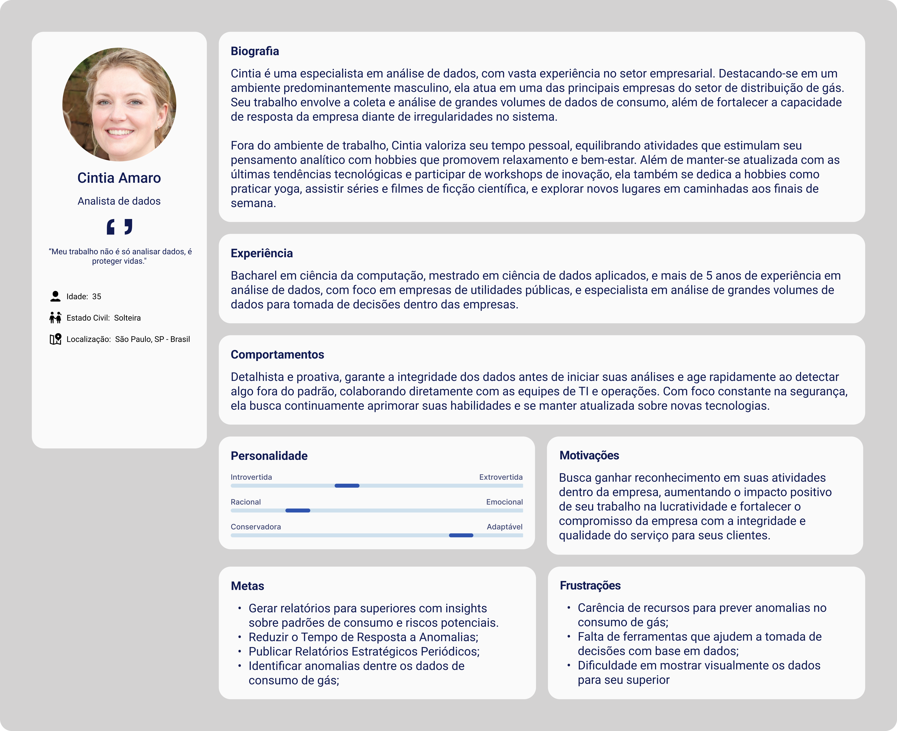<br>

<div align="center">
<sup>Fonte: Material produzido pelos autores (2024)
</sup>
</div>

&emsp;Neste contexto, foi desenvolvida a persona Cintia, uma especialista em análise de dados no setor de distribuição de gás. Cintia representa os principais usuários do sistema que o projeto busca atingir, sendo a única persona de dados projeto. Tal escolha de trabalhar com apenas uma persona que represente a área de dados, como a Cintia, foi feita para garantir foco e profundidade ao projeto. Ao concentrar-se em uma única persona nesse setor importante para o produto, a equipe de desenvolvimento e design pode criar soluções mais alinhadas, tornando mais relevante a solução feita.

&emsp;Cintia é uma especialista em análise de dados que atua em uma bigtech de distribuição de gás. Com vasta experiência no setor, ela desempenha um papel fundamental na coleta e análise de grandes volumes de dados de consumo, visando identificar anomalias e otimizar a eficiência dos serviços de distribuição. Sua rotina inclui a análise diária de dados de milhares de clientes. Cintia é movida pelo desejo de obter maior reconhecimento dentro da empresa e trabalha continuamente para alcançar esse objetivo, tornando-se uma referência em seu campo.

&emsp;Em adição, o desenvolvimento de um mapa de empatia foi fundamental para aprofundar o entendimento da persona Cintia. Através desse exercício, foi possível explorar o que o usuário pensa, vê, fala e faz, oferecendo uma visão mais completa das suas necessidades e expectativas para o design do projeto.

<div align="center" width="100%">
<sub>Figura 10 Mapa de Empatia da Cintia</sub><br>

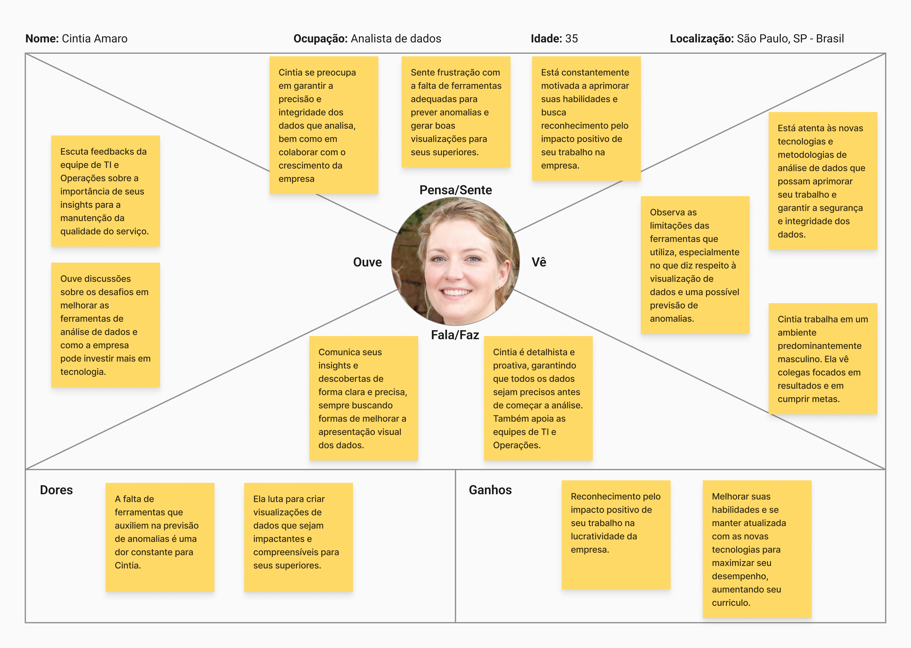

<sup>Fonte: Material produzido pelos autores (2024)
</sup>
</div>

&emsp;Através do recurso disposto acima, é possível desenvolver uma análise mais profunda sobre a Cíntia. É notável que ela é uma profissional que se sente muito motivada em relação a buscar se capacitar para desenvolver o melhor trabalho que ela pode, bem como uma pessoa bastante observadora que consegue perceber insights e desenvolver rapidamente a correlação de dados.

&emsp;Apesar de se considerar uma pessoa introvertida, quando se trata de dados, Cíntia consegue se comunicar perfeitamente. Expondo as conclusões que ela chegou ao fazer a análise de um conjunto de dados, ela se sente mais que confortável. A escuta ativa aos seus gestores e supervisores faz parte do seu cotidiano e é sempre uma experiência que ela reconhece como valiosa para que ela se desenvolva ainda mais no seu trabalho.

&emsp;A proposta de modelo preditivo é uma ferramenta que se mostra bastante interessante para Cíntia, porque tornaria mais fácil detectar as anomalias na distribuição de gás, além de auxiliar na visualização desses dados através de gráficos gerados a partir de bibliotecas integradas ao modelo. Através dele, Cintia pode se tornar uma profissional mais adaptável a novas tecnologias no contexto empresarial, qualidade que valoriza, além de obter reconhecimento e aumentar a lucratividade de sua empresa.

**Persona 2: Pedro Benedetto, Gerente de Produtos**

&emsp;Conforme dados divulgados por pesquisa desenvolvida pelo Instituto Brasileiro de Geografia e Estatística, em 2024, fez-se possível visualizar que homens ocupam 6 de 10 vagas relacionadas a posições de gerência. O gênero da persona foi escolhido com base nesse critério estatístico. Além disso, enquadrou-se a persona como bacharéu em administração por ser um curso com grande presença de estudantes universitários, sendo considerado o curso mais popular no formato presencial particular, segundo dados do Censo da Educação Superior divulgado em 2021. Curso que permite uma introdução abrangente ao mercado.

<div align="center" width="100%">
<sub>Figura 11 Persona Pedro</sub><br>

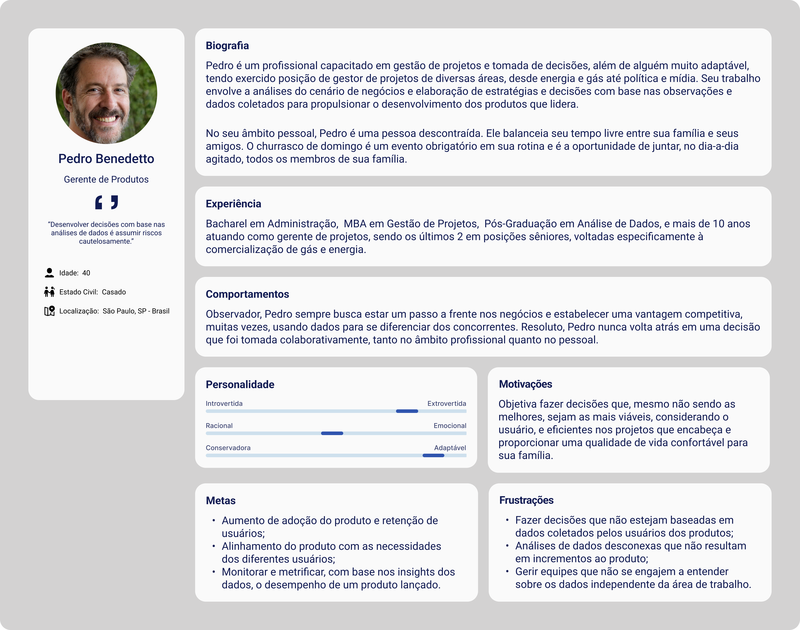
<sup>Fonte: Material produzido pelos autores (2024)
</sup>
</div>

&emsp;Neste cenário, foi desenvolvida a persona Pedro, um profissional experiente em gestão de projetos e tomadas de decisões estratégicas. Pedro representa os gerentes de produtos, um dos principais recortes de público-alvo que o projeto almeja empatizar com. Pedro é um gestor de projetos adaptável com mais de 10 anos de experiência, atuando em áreas como energia, gás, política e mídia. Sua expertise inclui a análise de cenários de negócios e a elaboração de estratégias baseadas em dados para impulsionar o desenvolvimento de produtos. No âmbito pessoal, Pedro é descontraído, equilibrando seu tempo entre a família e os amigos, com o churrasco de domingo sendo uma tradição.

&emsp;Como bacharel em Administração, com MBA em Gestão de Projetos e pós-graduação em Análise de Dados, Pedro foca no aumento da adoção e retenção de produtos, alinhando-os às necessidades dos usuários. Ele valoriza a coleta e análise de dados como ferramentas essenciais para a tomada de decisões, visando sempre proporcionar qualidade de vida para sua família. A falta de decisões baseadas em dados e a desconexão nas análises que não resultam em melhorias concretas para o produto são pontos que Pedro busca evitar.

&emsp;Como desenvolvido para a persona Cintia, foi também elaborado para o Pedroum mapa de empatia para que fosse possível explorar o que o usuário pensa, vê, fala e faz, oferecendo uma visão mais completa das suas necessidades e expectativas para o design do MVP.

<div align="center" width="100%">
<sub>Figura 12 Mapa de Empatia do Pedro</sub><br>

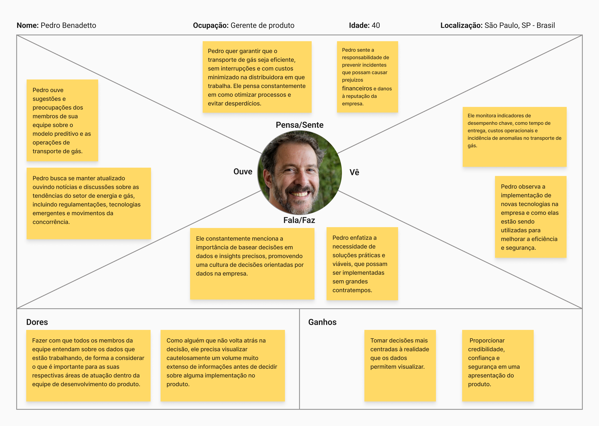
<sup>Fonte: Material produzido pelos autores (2024)</sup>
</div>

&emsp;Através do mapa de empatia, é possível, como foi feito com a Cintia, desenvolver uma análise mais profunda sobre Pedro. É notável que ele é um profissional comprometido com a otimização de processos e a minimização de custos no transporte de gás, visando eficiência e evitando desperdícios.

&emsp;Pedro sente a responsabilidade de prevenir incidentes que possam causar prejuízos financeiros e danos à reputação da empresa. Ele valoriza as sugestões da equipe e busca estar atualizado sobre as tendências do setor de energia e gás. Como gerente de produtos, ele promove uma cultura de decisões orientadas por dados e prioriza soluções práticas e viáveis. Ele monitora indicadores de desempenho, focando na melhoria contínua e na implementação eficaz de novas tecnologias para aprimorar a eficiência e segurança.

&emsp;Para Pedro, é desafiador garantir que todos na equipe compreendam a importância dos dados com os quais trabalham. Ele busca tomar decisões bem informadas e proporcionar credibilidade e segurança nas apresentações de produtos. A proposta de modelo preditivo o ajudaria muito, já que, os relatórios que receberia do analista de dados estariam melhor embasados e fidedignos à realidade, proporcionando melhores compreensões sobre determinadas iniciativas importantes para o produto.

&emsp;Em suma, desenvolver personas e atribuí-las como referência e foco do desenvolvimento do projeto para a Compass faz com que o modelo preditivo para a detecção de anomalias atenda, de fato, as necessidades de quem irá utilizá-lo. O mapa de empatia contribui para isso, já que cria um senso de maior profundidade a esse recorte representativo do público-alvo do projeto.

#### 4.1.6.1 User Stories

As User Stories são uma forma simples e objetiva de descrever as necessidades dos usuários finais em relação ao sistema que estamos desenvolvendo. Elas representam, de maneira clara, as funcionalidades que o sistema precisa ter para atender às expectativas de diferentes personas, que são os perfis de usuários que utilizarão ou serão impactados pelo projeto.

No caso do nosso projeto, criamos User Stories para dois perfis principais: Pedro, o gerente de operações, e Cintia, a analista de dados. Cada uma dessas histórias detalha as funcionalidades e resultados esperados por esses usuários, garantindo que o desenvolvimento esteja alinhado com as suas necessidades reais.

Essas histórias ajudam a equipe de desenvolvimento a entender o que deve ser priorizado, quais problemas precisam ser resolvidos, e como as soluções serão utilizadas no contexto do negócio, sempre focando na clareza e na eficácia do sistema.

<div align="center">

<sub>Tabela 2 - User Story 1</sub><br>
Identificação | US01  
--- | ---  
Persona | Pedro  
User Story | Como gerente de operações, eu preciso visualizar as principais métricas do modelo de previsão de consumo para avaliar a precisão dos resultados e tomar decisões operacionais informadas.  
Critério de aceitação | O sistema deve apresentar pelo menos três métricas claras sobre a performance do modelo, como acurácia, recall e RMSE, para que eu possa avaliar a qualidade da previsão.  

<sup>Fonte: Material produzido pelos autores (2024)</sup>

</div>

<br>
<br>

<div align="center">

<sub>Tabela 3 - User Story 2</sub><br>
Identificação | US02  
--- | ---  
Persona | Pedro  
User Story | Como gerente de operações, eu quero ter uma explicação clara das features utilizadas no modelo de previsão de consumo para garantir que as variáveis mais relevantes estão sendo consideradas.  
Critério de aceitação | O modelo deve apresentar uma lista detalhada das features e justificativas de sua inclusão, para garantir que estou ciente de quais fatores influenciam a previsão.  

<sup>Fonte: Material produzido pelos autores (2024)</sup>

</div>

<br>
<br>

<div align="center">

<sub>Tabela 4 - User Story 3</sub><br>
Identificação | US03  
--- | ---  
Persona | Cintia  
User Story | Como analista de dados, eu preciso acessar e discutir os resultados do primeiro modelo candidato, analisando as métricas de performance para identificar possíveis ajustes.  
Critério de aceitação | O modelo candidato deve estar disponível com explicações claras das métricas de performance e sugestões para melhorias.  

<sup>Fonte: Material produzido pelos autores (2024)</sup>

</div>

<br>
<br>

<div align="center">

<sub>Tabela 5 - User Story 4</sub><br>
Identificação | US04  
--- | ---  
Persona | Cintia  
User Story | Como analista de dados, eu quero que o modelo candidato inclua uma explicação sobre as decisões tomadas pelo modelo, detalhando o impacto das variáveis nas previsões.  
Critério de aceitação | Pelo menos um dos modelos supervisionados deve apresentar explicabilidade, mostrando claramente como as variáveis influenciam as previsões.  

<sup>Fonte: Material produzido pelos autores (2024)</sup>

</div>

<br>
<br>

<div align="center">

<sub>Tabela 6 - User Story 5</sub><br>
Identificação | US05  
--- | ---  
Persona | Pedro  
User Story | Como gerente de operações, eu preciso visualizar a comparação entre diferentes modelos de previsão para escolher aquele que melhor atenda às necessidades do negócio.  
Critério de aceitação | O sistema deve apresentar pelo menos três modelos candidatos com suas respectivas métricas de comparação, permitindo que eu avalie a performance de cada um.  

<sup>Fonte: Material produzido pelos autores (2024)</sup>

</div>

<br>
<br>

<div align="center">

<sub>Tabela 7 - User Story 6</sub><br>
Identificação | US06  
--- | ---  
Persona | Pedro  
User Story | Como gerente de operações, eu quero garantir que os modelos candidatos sejam otimizados para fornecer as previsões mais precisas, ajudando nas decisões operacionais.  
Critério de aceitação | Pelo menos um dos modelos deve ser otimizado através de um processo como Grid Search ou Random Search, para garantir que os melhores hiperparâmetros foram selecionados.  

<sup>Fonte: Material produzido pelos autores (2024)</sup>

</div>

<br>
<br>

<div align="center">

<sub>Tabela 8 - User Story 7</sub><br>
Identificação | US07  
--- | ---  
Persona | Cintia  
User Story | Como analista de dados, eu quero selecionar as métricas comparativas dos modelos baseadas no que é mais importante para o problema, para garantir que os modelos são avaliados de forma adequada.  
Critério de aceitação | O sistema deve apresentar uma justificativa clara para a escolha das métricas comparativas, como acurácia, precisão e recall, para assegurar que os modelos são avaliados corretamente.  

<sup>Fonte: Material produzido pelos autores (2024)</sup>

</div>

<br>
<br>

<div align="center">

<sub>Tabela 9 - User Story 8</sub><br>
Identificação | US08  
--- | ---  
Persona | Pedro  
User Story | Como gerente de operações, eu quero ver o modelo final escolhido para ser implementado em produção e garantir que ele atende aos critérios de precisão exigidos.  
Critério de aceitação | O modelo final deve ser claramente indicado no Colab, com as métricas que comprovem sua performance, para garantir sua aplicabilidade no contexto real do negócio.  

<sup>Fonte: Material produzido pelos autores (2024)</sup>

</div>

<br>
<br>

<div align="center">

<sub>Tabela 10 - User Story 9</sub><br>
Identificação | US09  
--- | ---  
Persona | Cintia  
User Story | Como analista de dados, eu preciso revisar e refinar o repositório do Github conforme os padrões de qualidade estabelecidos, para assegurar que ele está em conformidade com o template do Escritório de Projetos.  
Critério de aceitação | O repositório do Github deve estar formatado de acordo com o template fornecido e seguir os padrões de qualidade para assegurar sua consistência e organização.  

<sup>Fonte: Material produzido pelos autores (2024)</sup>

</div>

<br>
<br>

<div align="center">

<sub>Tabela 11 - User Story 10</sub><br>
Identificação | US10  
--- | ---  
Persona | Cintia  
User Story | Como analista de dados, eu quero revisar os resultados do modelo final, verificando a aceitação ou refutação das hipóteses formuladas anteriormente, para garantir que o modelo responde ao problema proposto.  
Critério de aceitação | A Seção 5 do documento deve conter a verificação das hipóteses da seção 4.2.3, permitindo avaliar se foram aceitas ou refutadas com base nos resultados do modelo.  

<sup>Fonte: Material produzido pelos autores (2024)</sup>

</div>

<br>
<br>

<div align="center">

<sub>Tabela 12 - User Story 11</sub><br>
Identificação | US11  
--- | ---  
Persona | Pedro  
User Story | Como gerente de operações, eu quero garantir que todas as revisões sugeridas pelos professores foram realizadas, para assegurar que o Colab final atenda aos requisitos de qualidade.  
Critério de aceitação | O sistema deve mostrar evidências de que os apontamentos mapeados anteriormente foram revisados e implementados, para garantir a conformidade com as recomendações dos professores.  

<sup>Fonte: Material produzido pelos autores (2024)</sup>

</div>

#

#### 4.1.7. Jornadas do Usuário

&emsp;A Jornada de Usuário, de acordo com Sarah Gibbons, é uma ferramenta de UX que visualiza o processo pelo qual uma pessoa passa para alcançar um objetivo, mapeando suas ações, pensamentos e emoções. Essa jornada é composta por cinco elementos principais: o ator (usuário), o cenário e expectativas, as fases da jornada, as ações, mentalidades e emoções, e as oportunidades de melhoria. A criação de um mapa de jornada é relevante para alinhar a visão da equipe e otimizar a experiência do usuário, revelando pontos de frustração e satisfação ao longo das interações.

&emsp;Dessa maneira, compreendendo a importância desse instrumento para que a persona, entrando como o ator nos parâmetros mencionados, seja ainda melhor entendida e abarcada pelo projeto, seguem, abaixo, as jornadas de usuário desenvolvidas para a Cintia e o Pedro:

**Jornada de Usuário da Cintia**

<div align="center" width="100%">
<sub>Figura 13 - Jornada de Usuário da Cintia Amaro</sub>
</div><br>

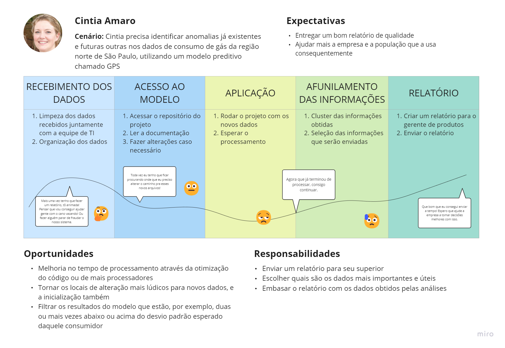
<br>

<div align ="center">
<sup>Fonte: Material produzido pelos autores (2024)
</sup>
</div>

&emsp;Cintia é responsável por identificar anomalias nos dados de consumo de gás da região norte de São Paulo usando o modelo preditivo chamado GPS (Gas Prediction System). Sua principal meta é fornecer um relatório de qualidade que ajude tanto a empresa quanto a população, detectando problemas como vazamentos de gás ou fraudes. Sua jornada começa com o recebimento dos dados, onde ela colabora com a equipe de TI para limpar e organizar as informações, garantindo que tudo esteja preparado para análise.

&emsp;Depois de organizar os dados, Cintia acessa o repositório do projeto e consulta a documentação do modelo GPS. Ela verifica se são necessárias alterações para acomodar os novos dados, um processo que exige ajustes frequentes, pois os caminhos dos arquivos mudam com frequência. Em seguida, ela roda o modelo preditivo com os dados atualizados e aguarda o processamento, um passo essencial para garantir que as previsões sejam baseadas nas informações mais recentes.

&emsp;Uma vez que o processamento é concluído, Cintia passa para o afunilamento das informações, realizando um cluster dos resultados obtidos para selecionar os dados mais relevantes. Esses dados são então incluídos em um relatório detalhado que ela envia ao gerente de produtos. O relatório tem o objetivo de auxiliar a empresa a tomar decisões informadas, melhorando a segurança e eficiência no uso do gás. Ao longo desse processo, ela vê oportunidades para melhorar o tempo de processamento e simplificar as etapas de ajuste do modelo para novos dados, além de filtrar anomalias mais significativas para otimizar a eficácia do sistema.

&emsp;Assim, a jornada desenvolvida para Cintia busca representar as oportunidades que surgem conforme cada fase é concluída. Dessa forma, as necessidades evidenciadas indicam um potencial que deve ser atendido pelo GPS para que ela possa contribuir para a tomada de melhores decisões e desenvolver a sua jornada com o mínimo número possível de contratempos devido a alguma questão instrumental.

**Jornada de Usuário do Pedro**

<div align="center" width="100%">
<sub>Figura 14 - Jornada de Usuário do Pedro Benedetto</sub>
</div><br>

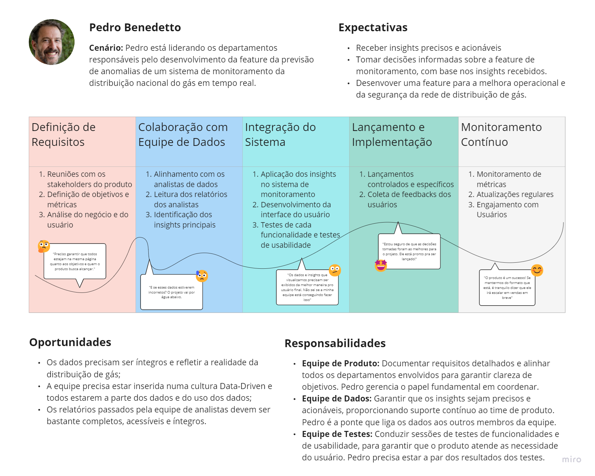<br>

<div align ="center">
<sup>Fonte: Material produzido pelos autores (2024)
</sup>
</div>

&emsp;Pedro, como Gerente de Produtos no mercado de gás, lidera o desenvolvimento da feature de previsão de anomalias para um sistema de monitoramento da distribuição de gás em tempo real. Sua jornada começa com o planejamento e a definição de requisitos, onde ele organiza reuniões com stakeholders para alinhar expectativas e estabelecer objetivos claros. Nesta fase, a equipe de produto documenta os requisitos e define métricas que guiarão o sucesso do projeto.

&emsp;Em seguida, Pedro colabora estreitamente com a equipe de dados para entender as capacidades do modelo preditivo e garantir que os insights fornecidos sejam precisos e acionáveis. Juntos, eles definem os parâmetros para a detecção de anomalias e asseguram que todos os dados relevantes estejam disponíveis. Posteriormente, Pedro coordena o desenvolvimento e a integração desses insights no sistema de monitoramento, trabalhando com a equipe de desenvolvimento para criar uma interface de usuário intuitiva e conduzindo testes para validar a integração.

&emsp;Por fim, para a concretização dessa jornada de usuário, Pedro supervisiona o lançamento e a implementação da feature, organizando treinamentos para as equipes de campo e realizando um lançamento controlado para testar o sistema em condições reais. Ele coleta feedback para identificar melhorias antes do lançamento completo. Após a implementação, ele continua monitorando as métricas e promove atualizações regulares, engajando-se com os usuários para garantir que o sistema se adapte às novas necessidades e desafios, mantendo sua eficácia e relevância ao longo do tempo.

&emsp;A jornada desenvolvida de forma macroscópica, para Pedro, busca representar as oportunidades que surgiriam conforme as fases fossem sendo atingidas. Dessa forma, salientaram-se necessidades que seriam correspondidas pelo desenvolvimento do modelo preditivo de gás para a Compass, etapa que se alinha mais à fase 2 de comunicação com a equipe de dados. Que se refletem em: "Os dados precisam ser íntegros e refletir a realidade da distribuição de gás"; "a equipe precisa estar inserida numa cultura Data-Driven e todos estarem a parte dos dados e do uso dos dados"; "Os relatórios passados pela equipe de analistas devem ser bastante completos, acessíveis e íntegros. A identificação dessas principais necessidades realça, mais uma vez, o quão importante esse instrumento é para a entrega do MVP proposto.

#

&nbsp;&nbsp;&nbsp;Com a apresentação das jornadas das duas personas criadas, fica evidente que o projeto do modelo preditivo visa intervir em um contexto que é marcado por oportunidades reais. As fases dispostas, em ambas as jornadas, foram idealizadas conforme a rotina de profissionais que trabalham cotidianamente no mercado de gás, para trazer melhor ressonância com o que de fato ocorre. As features que serão desenvolvidas no modelo preditivo podem, agora, ter a sensação de serem direcionadas a ocuparem espaços relevantes nas rotinas tanto da Cintia quanto do Pedro.

#### 4.1.8 Política de Privacidade

&emsp;Uma Política de Privacidade é um documento essencial que descreve como uma organização ou empresa coleta, utiliza, armazena e protege os dados pessoais de seus usuários, clientes ou qualquer indivíduo com quem interage. Ela serve como um guia transparente e detalhado sobre as práticas de privacidade da organização, informando aos indivíduos como seus dados serão tratados e quais direitos eles possuem em relação a essas informações.

##
Última atualização: Agosto de 2024

&emsp;A Gas Protection Team valoriza a privacidade e se compromete a proteger os dados de todos os seus clientes, parceiros, fornecedores e usuários que acessam nossos serviços B2B ou qualquer plataforma relacionada. Esta Política de Privacidade descreve como coletamos, usamos e compartilhamos informações fornecidas por nossos parceiros de negócios.

&emsp;<strong>AO UTILIZAR NOSSOS SERVIÇOS B2B OU FORNECER QUALQUER DADO, VOCÊ CONCORDA COM ESTA POLÍTICA DE PRIVACIDADE.</strong>

## Definições
<ul>
<li>Dados Pessoais: Qualquer informação que possa identificar uma pessoa, como nome, CPF, data de nascimento, endereço IP, etc.</li>
<li>Dados Pessoais Sensíveis: Informações sobre raça, religião, opiniões políticas, saúde ou vida sexual.</li>
<li>Tratamento de Dados Pessoais: Qualquer operação realizada com Dados Pessoais, como coleta, armazenamento, uso e compartilhamento.</li>
<li>Lei nº 13.709/2018: LGPD, que estabelece diretrizes para o tratamento de dados pessoais </li>
<li>Uso de Dados Pessoais</li>
</ul>
&emsp;Usamos os Dados Pessoais fornecidos por nossos parceiros para:
<ul>
<li>Prestar e gerenciar nossos serviços B2B.</li>
<li>Cumprir obrigações contratuais.</li>
<li>Melhorar nossos serviços e desenvolver novas soluções.</li>
<li>Enviar informações relevantes sobre nossos serviços.</li>
<li>Entrar em contato com você para fins comerciais.</li>
<li>Também podemos usar seus dados para cumprir obrigações legais, proteger nossos direitos e prevenir fraudes.</li>
</ul>

## Dados Coletados

&emsp;Coletamos os Dados Pessoais que nossos parceiros nos fornecem para a prestação dos serviços B2B, incluindo:

<ul>
<li>Dados de medidores</li>
<li>Consumo de gás natural</li>
<li>Informações como Bairro, Cidade, CEP</li>
<li>Modelo do medidor</li>
</ul>

&emsp;Podemos compartilhar seus dados com:
<ul>
<li>Empresas parceiras Compass, Iolit e Cosan</li>
<li>Autoridades, quando exigido por lei.</li>
</ul>

## Segurança dos Dados

&emsp;Implementamos medidas de segurança para garantir a proteção dos seus dados. Os dados são armazenados localmente  durante o projeto e com acesso restrito à membros do grupo.
&emsp;Os dados serão armazenados pelo período de 10 semanas, mesma duração do projeto.
&emsp;A GPT utiliza a linguagem Python e bibliotecas de análise de dados para identificar anomalias. Não utilizamos cookies ou tecnologias de rastreamento.

## Direitos do Usuário

&emsp;Você tem o direito de:
<ul>
<li>Confirmar se estamos tratando seus dados.</li>
<li>Acessar seus dados.</li>
<li>Corrigir seus dados.</li>
<li>Solicitar a anonimização, bloqueio ou exclusão de dados.</li>
<li>Solicitar a portabilidade dos seus dados.</li>
<li>Revogar seu consentimento para o tratamento de dados.</li>
<li>Atualizações da Política</li>
</ul>
&emsp;Podemos atualizar esta política a qualquer momento. As alterações serão comunicadas aos nossos parceiros.

## Contato

&emsp;Para dúvidas ou solicitações sobre seus dados, entre em contato com nosso Encarregado de Proteção de Dados: lucas.costa@sou.inteli.edu.br


##
&emsp;A Política de Privacidade disposta é, então, um elemento essencial não só quando se pensa em estar em conformidade com a Lei Geral de Proteção de Dados, mas também quando se considera uma ferramenta de estabelecer confiança com os parceiros e clientes do projeto. É através dela que é possível assegurar a nossa dedicação frente a garantir privacidade dos dados disponibilizados para o desenvolvimento do modelo preditivo.


### 4.2. Compreensão dos Dados

&emsp;Esta seção está localizada no arquivo: [Compreensão Dados](../notebooks/compreensaoDados.ipynb)

### 4.3. Preparação dos Dados e Modelagem

&emsp;Esta seção está localizada no arquivo: [Compreensão Dados](../notebooks/compreensaoDados.ipynb)

### 4.4. Comparação de Modelos

&emsp;Esta seção está localizada no arquivo: [Compreensão Dados](../notebooks/compreensaoDados.ipynb)

### 4.5. Avaliação

&emsp;Esta seção está localizada no arquivo: [Compreensão Dados](../notebooks/compreensaoDados.ipynb)

## <a name="c5"></a>5. Conclusões e Recomendações

&emsp;Com o modelo pretitivo, GPS, foi possível identificar e separar o consumo dos clientes em 7 diferentes tipos sendo eles, consumo normal, consumo zerado, consumo negativo, mais que 3 desvio padrão e sem medição (1 dia, 7 dias e 30 dias). A partir disso conseguimos chegar em um resultado otimista de 97% de acurácia no conjunto de teste passado a nós pelo parceiro.

&emsp;Para ter acesso aos insights gerados pelo modelo, terá que acessar o <a href="https://modelo-preditivo-grupo4.streamlit.app/">site</a> desenvolvido pelo prórpio grupo utilizando da tecnologia do Streamlit. Nele você consiguirá visualizar de forma mais clara dados e caso precise de auxílio acesse a seção de "como utilizar" na própria plataforma.

&emsp;Toda a solução foi projetada tendo em foco o consumidor final, sendo ele os analistas de dados (que receberão os insights em primeira mão) ou sendo um dos clientes com o seu consumo registrado, por isso os dados visam ser claros e de fácil entendimento assim a empresa contatará primeiramente o cliente de forma online para entender se está acontecendo algum tipo de consumo anômulo de fato no medidor e, caso necessário, enviar um técnico até o local para verificar e resolver o problema. 

## <a name="c6"></a>6. Referências

CASAROTTO, Camila. **As 5 forças de Porter: o que são, para que servem e como aplicar?** Rock Content, 2020. Disponível em: https://rockcontent.com/br/blog/5-forcas-de-porter/. Acesso em: 22 de abr. de 2024.

Minetto Napoleão, Bianca. “Matriz de Riscos (Matriz de Probabilidade E Impacto).” Ferramentas Da Qualidade, 26 June 2019, [ferramentasdaqualidade.org/matriz-de-riscos-matriz-de-probabilidade-e-impacto/.](ferramentasdaqualidade.org/matriz-de-riscos-matriz-de-probabilidade-e-impacto/)

BRASIL. Lei nº 13.709, de 14 de agosto de 2018. Lei Geral de Proteção de Dados Pessoais (LGPD).

SOUZA, Maria da Silva; CARVALHO, João de Oliveira. Análise SWOT: um estudo sobre a aplicação em pequenas empresas. Revista Brasileira de Administração, v. 12, n. 4, p. 45-58, 2019.

OSTERWALDER, Alexander; PIGNEUR, Yves; BERNARDA, Gregory; SMITH, Alan. Value Proposition Design: How to Create Products and Services Customers Want. Hoboken: Wiley, 2014.

**State of Data 2022 Um raio-x dos profissionais de dados do Brasil.** [s.l: s.n.]. Disponível em: <https://www.bain.com/contentassets/16494c60fcd045188615f05e728385b3/state-of-data2022_um-raio-x-dos-profissionais-de-dados-do-brasil.pdf>.

**‌Data Scientist Demographics and Statistics [2022]: Number Of Data Scientists In The US.** Disponível em: <https://www.zippia.com/data-scientist-jobs/demographics/>.

GIBBONS, Sarah. Journey Mapping 101. Nielsen Norman Group, 2018. Disponível em: https://www.nngroup.com/articles/journey-mapping-101/.


## <a name="attachments"></a>Anexos
```
Utilize esta seção para anexar materiais como manuais de usuário, 
documentos complementares que ficaram grandes e não couberam no 
corpo do texto etc.

Remova este bloco ao final
```
